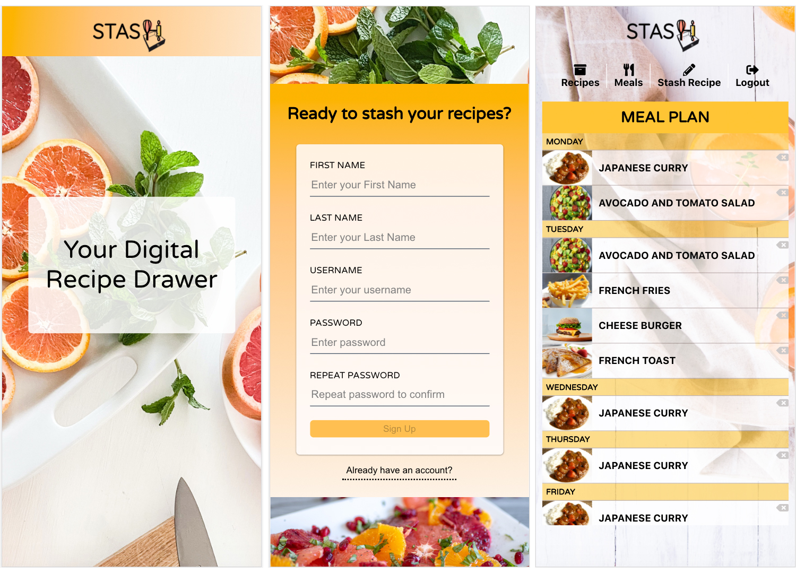
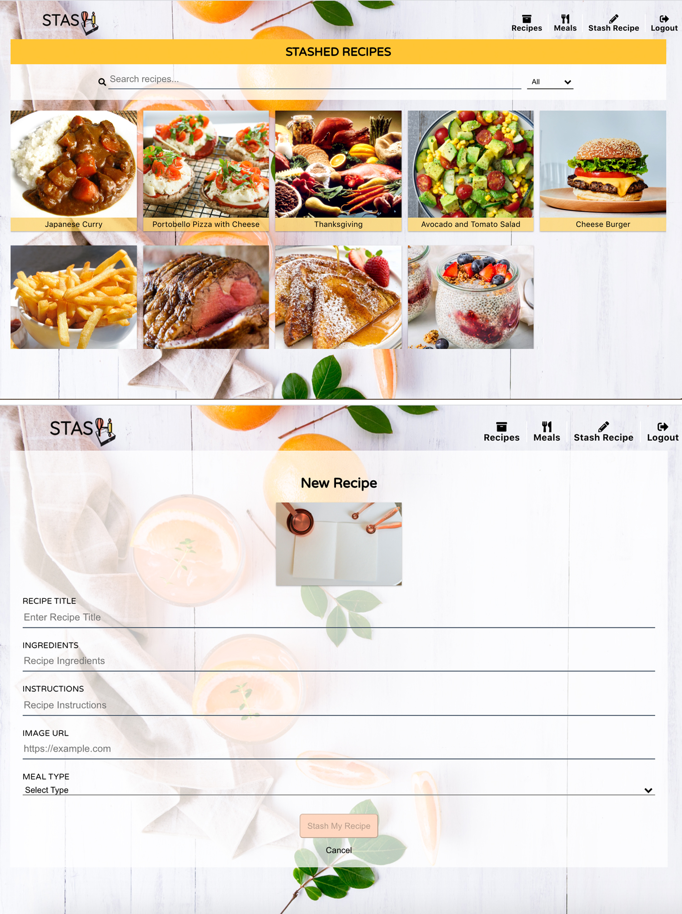

# STASH Client

**Table of Contents**
1. [Introduction](#introduction)
2. [Technologies Used](#technologies)
3. [Future Implementations](#future-implementations)

**Live Demo:** [Stash](https://stash-zeta.vercel.app)
-- Demo Account --  
username: demouser
password: P@ssword1! 

## Introduction
Don't leave your recipes lying around on pieces of paper. Having trouble finding that secret family recipe or your favorite meal? Keep your recipes stashed in this digital drawer! You can even plan your meals for the week.No more wasting time thinking of what to cook!

Stash was created to showcase my full stack abilities. The inspiration came from the need to look for recipe notes scattered in my phone, different cookbooks, and index cards stord in separate places.

## Screenshots

## Technologies
* React
* Node.JS
* Postgresql
* JSON Web Token (JWT) Authentication
* JavaScript
* HTML/CSS
* Stash API - [Documentation]((https://documenter.getpostman.com/view/5109644/TVmHDexk))
* Deployed to Vercel

### Development
Run locally: `npm start`
Deploy to Vercel: `vercel`

## Future Implementations
* Adding more information to recipes (e.g. calories, cook time, prep time)
* Tags on recipes for more filters
* Restructure recipe model to allow possible build of grocery list
